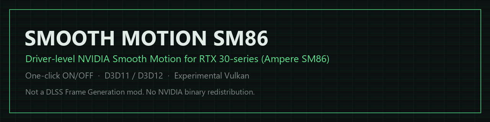
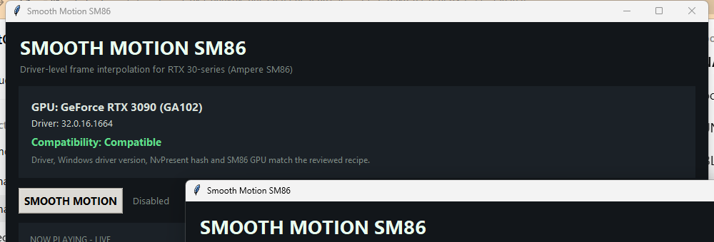
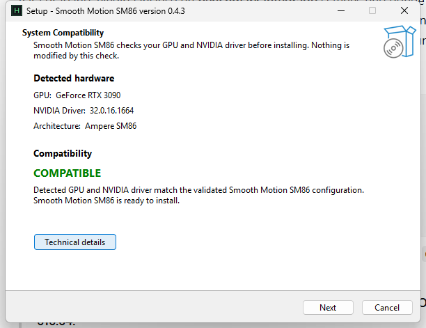

[English](README.md) | 简体中文 | [Español](README.es-419.md)

  

# Smooth Motion SM86 — 适用于 RTX 30 系列的 NVIDIA Smooth Motion

**NVIDIA Smooth Motion 在 RTX 30 系列 / Ampere SM86 上运行。一个安装程序。无需按游戏进行帧生成集成。**

Smooth Motion SM86 让 NVIDIA 驱动级的 **NvPresent / Smooth Motion** 帧插值路径
在 NVIDIA 目前尚未开放的 Ampere SM86 GPU 上运行 —— 以一键式 Windows 工具的形式。

> **不是 DLSS Frame Generation 模组。**
> 它使用 NVIDIA 的呈现级 Smooth Motion 路径，而无需游戏进行
> Streamline / DLSS-G 集成。

**⬇ [下载 Windows 版 Smooth Motion SM86 v0.5.0](https://github.com/xikarioz/Smooth-Motion-RTX30/releases/latest)**

> **当前版本：v0.5.0。** 包含管理器启动崩溃修复、简体中文安装程序动态字段修复、更清晰的关闭/托盘行为说明，以及针对特定已识别 **591.86** NvPresent 版本的实验性**静态验证**路径。**616.64 仍为实机验证的黄金配置。** 591.86 尚未实机验证——请测试并反馈。

**预览版：** [v0.5.2-alpha.1](https://github.com/xikarioz/Smooth-Motion-RTX30/releases/tag/v0.5.2-alpha.1) 针对仍开放的启动器和托盘问题。它不是上面的稳定版；安装前请阅读[已验证范围与待确认事项](RELEASE_0.5.2_ALPHA.md)。

RTX 30 / SM86 · D3D11 · D3D12 · 实验性 Vulkan · Windows 10/11 x64

目标架构：**RTX 30 系列 / Ampere SM86。** **RTX 3090 + 驱动程序 616.64** 已通过实机
验证；特定已识别的 **591.86** NvPresent 版本为**静态验证 / 实验性**。未识别的驱动
程序并不等于“无法安装”——安装程序和管理器仍可运行，Smooth Motion 保持**故障关闭**，
直到你安装的 NvPresent 二进制文件被识别并通过验证。

**已在 16 款真实游戏中测试，涵盖多种引擎和启动环境 —— 包括 D3D11、D3D12 和 Game Pass 游戏。**

---

## 实际运行效果

**真实的同场景 ON → OFF → ON 录制即将推出。**

该演示将使用未经修改的游戏画面，不使用合成插值，也不对播放速度进行任何操控。

## 真实游戏测试

| 游戏 | 测试状态 |
|---|---|
| Assassin's Creed Origins | ✅ 观察到 Smooth Motion 可用 |
| Assassin's Creed Odyssey | ✅ 运行时 / 实时 ON → OFF → ON 验证 |
| Black Myth: Wukong | ✅ 观察到 Smooth Motion 可用 |
| Resident Evil 4 | ✅ 观察到 Smooth Motion 可用 |
| Resident Evil Requiem | ✅ 观察到 Smooth Motion 可用 |
| Alan Wake 2 | ✅ 观察到 Smooth Motion 可用 |
| Cyberpunk 2077 | ✅ 观察到 Smooth Motion 可用 |
| The Last of Us | ✅ 观察到 Smooth Motion 可用 |
| Hogwarts Legacy | ✅ 观察到 Smooth Motion 可用 / 测量工作负载 |
| Clair Obscur: Expedition 33 — Game Pass | ✅ 观察到 Smooth Motion 可用 |
| Marvel's Spider-Man 2 | ✅ 观察到 Smooth Motion 可用 |
| Hades | ✅ 观察到 Smooth Motion 可用 |
| Until Dawn | ✅ 观察到 Smooth Motion 可用 |
| Kingdom Come: Deliverance II | ✅ 观察到 Smooth Motion 可用 |
| Persona 3 Reload | ✅ 观察到 Smooth Motion 可用 |
| Pragmata | ✅ 观察到 Smooth Motion 可用 |

> **证据说明：**“观察到可用”表示 Smooth Motion 已启用，并且其效果在真实游戏过程中被直接观察到。这并不意味着每个游戏都获得了同等程度的仪器化测试或独立的帧内容验证。

## 快速开始

1. 从[最新版本](https://github.com/xikarioz/Smooth-Motion-RTX30/releases/latest)下载 **`SmoothMotionSM86-Setup.exe`**。
2. 运行它（无需管理员权限，无需 Python，无需终端）。
3. 打开 **Smooth Motion SM86**。
4. 开启 **SMOOTH MOTION**。
5. 选择一款游戏并按 **开始游戏**。

完整指南：[INSTALL.zh-CN.md](INSTALL.zh-CN.md) · 问题排查：[TROUBLESHOOTING.zh-CN.md](TROUBLESHOOTING.zh-CN.md)

## 你将获得

一个以玩家为先的管理器，替你完成最难的部分：

- **自动检测 GPU 和驱动程序**，并提供通俗易懂的兼容性状态。
- **一键总开关**和**按游戏开关**。
- 针对受支持的运行中游戏提供**实时 ON/OFF** —— 可在游戏中随时切换（管理器按钮、可选的全局快捷键或**系统托盘**）进行同场景 A/B/A 对比，无需重启。结果以普通 Windows 通知的形式显示。
- **系统托盘**控制（状态、当前游戏、切换、打开管理器、退出）；管理器可关闭至托盘。
- **游戏库**扫描 Steam、Epic 和 Game Pass —— 选择一款游戏并开始游戏。
- **故障关闭式（失败即拒绝）**：如果无法识别你的驱动程序二进制文件，则不会修改任何内容。
- **可回滚**：回滚和卸载均已内置。DriverStore 绝不会被改动，也不会重新分发任何 NVIDIA 二进制文件。

## 这与 DLSS-G 模组有何不同？

中立地各用一行说明：

- **Smooth Motion SM86**：游戏 → NVIDIA 呈现路径 → **NvPresent / Smooth Motion** → 生成的帧。
- **DLSS Frame Generation 模组**：支持 DLSS-FG 集成的游戏 → Streamline / NGX → **DLSS-G** → 生成的帧。

不同的集成层，不同的适配点。本项目作用于驱动程序的呈现后端，而不是游戏的 DLSS-FG 集成。

## 兼容性

**当前策略（v0.5.0-rc.1 及以后）：仅凭驱动程序版本不再决定是否可以安装本应用。**
安装程序和管理器在未知驱动程序上仍可运行；Smooth Motion 激活保持**故障关闭**，直到
安装的 NvPresent 二进制文件被识别并通过验证。

| 配置 | 状态 | 管理器 | Smooth Motion |
|---|---|---|---|
| RTX 3090 + 驱动程序 616.64（黄金） | **实机验证** | 是 | 是 |
| 特定已识别的 591.86 NvPresent 版本 | **静态验证 / 实验性** | 是 | 实验性（尚未实机验证） |
| 未知 / 未验证的 NvPresent | 未验证 | 是 | 否——故障关闭 |
| 非 SM86 GPU（RTX 40/50、RTX 20、GTX 10、AMD/Intel） | 引擎不支持 | 是 | 否 |
| 多 GPU 系统 | 未实现设备选择 | 是 | 否 |

三个彼此独立的维度，特意保持区分：

- **硬件兼容性：** Ampere **SM86 / RTX 30 系列**是目标架构。
- **实机验证：** 只有 **RTX 3090 + 驱动程序 616.64** 经过实机验证。
- **其他单 GPU 的 SM86 RTX 30 显卡**在识别到确切的驱动程序/配置文件后属于**实验性**（并非“不支持”）。
- **D3D11** 动态引擎实时路径：**仪器验证**。**D3D12**：在真实游戏中观察到可用（动态引擎仪器化目前尚无定论）。
- **32 位游戏和受反作弊保护的游戏**不受支持。

> 历史说明：v0.4.x 版本仅限已验证的 616.64 配置文件。该限制已在 v0.5.0-rc.1 中取消；见发行说明。

详情与层级：[SUPPORT.zh-CN.md](SUPPORT.zh-CN.md) · [COMPATIBILITY.zh-CN.md](COMPATIBILITY.zh-CN.md) · [VALIDATION.zh-CN.md](VALIDATION.zh-CN.md)

## 验证

兼容性引擎为专有，因此改为公开记录证据。**[VALIDATION.zh-CN.md](VALIDATION.zh-CN.md)** 涵盖黄金系统、紧凑适配、运行时验证以及本项目的证据层级。

摘要：在已验证的 **RTX 3090 / 驱动程序 616.64** 黄金版本上，适配为 **41 个修改位点 / 共 61 字节** —— 20 个兼容的非 FP8 模块目标被适配，**17 个面向 FP8 的模块被有意排除**，且无需对任何经测试的非 FP8 SASS 指令进行重写。当前的研究引擎在运行时复现该黄金配置，包括变换一致性、事务性回滚以及重复的实时状态转换（300 次转换，0 次状态不匹配）。

- **D3D11** —— 在黄金配置上，实时 ON/OFF/ON 路径已通过**仪器验证**。
- **D3D12** —— 在真实 D3D12 游戏中**观察到 Smooth Motion 可用**，但当前活动动态引擎的运行时仪器化**尚无定论**（在最新的活动引擎验证窗口中未观察到目标模块加载流量）。这不归类为回归。

## 安全与信任

- **不重新分发 NVIDIA 二进制文件** —— 它从你自己安装的驱动程序中派生所需内容。
- **DriverStore 不受影响** —— 原始驱动程序文件绝不会被修改。
- **故障关闭式** —— 未知驱动程序/布局 → 不进行修补，并会告知你原因。
- **可回滚** —— 按版本安装、回滚、卸载。
- **隐私** —— 离线运行，无遥测，无账户；见 [PRIVACY.zh-CN.md](PRIVACY.zh-CN.md)。
- **已发布校验和** —— 对照 `SHA256SUMS.txt` 验证下载内容。
- **未签名的消费者预览版** —— SmartScreen 可能会提示；SHA-256 是完整性锚点。

## 已知限制

- 未签名的消费者预览版 —— SmartScreen 可能会提示；请验证 SHA-256。
- 关闭窗口（标题栏 **X**）会将 Smooth Motion SM86 保留在**系统托盘**中，以便继续后台监控。若要完全退出，请使用托盘图标中的**退出**。
- 会重新启动到新进程的商店游戏（部分 Game Pass / Epic）目前尚无法可靠跟踪。
- Windows Vulkan 为实验性；其中没有游戏内开关。
- **多 GPU 系统：当前消费者预览版期望单个 CUDA/NVIDIA 目标设备。明确选择渲染 GPU 的功能计划在后续版本中推出。** 这是管理器设备选择方面的限制，**并非**硬件不兼容。
- 强烈建议使用更高的基础 FPS；基础 FPS 过低会增加伪影并加剧可感知的延迟。

## 屏幕截图

已验证系统（RTX 3090 + 驱动程序 616.64）上的真实 **Smooth Motion SM86 管理器**：自动检测 GPU/驱动程序、兼容性状态、总开关以及实时的 **正在游戏** 控制。

**安装程序**会在安装任何内容之前检测你的 GPU、NVIDIA 驱动程序以及兼容性：

*在已验证的 RTX 3090 + 驱动程序 616.64 上进行的真实 v0.4.3 Setup 运行。*

## Linux（实验性预览版，需要反馈）

首个 Linux 版本以**预发布**形式提供：[linux-v0.1.0-experimental](https://github.com/xikarioz/Smooth-Motion-RTX30/releases/tag/linux-v0.1.0-experimental)。

- Linux 路线已在研究中于 **RTX 3080 · Ubuntu 26.04 · Wayland · NVIDIA 595.91.07** 上用 Hades（通过 Proton 运行的 DirectX）验证。
  **本打包安装程序尚未由项目在真实 Linux 硬件上运行过。** 请试用并反馈结果。
- 仅识别 NVIDIA **595.91.07** 驱动。其他驱动可以正常安装，但 Smooth Motion 保持**关闭**（失败即关闭），不会修改任何内容。
- 安装在用户目录，无需 root；绝不修改系统中的 NVIDIA 库。
- 无论能否运行，请使用 [Linux 标签](https://github.com/xikarioz/Smooth-Motion-RTX30/issues/new?labels=linux) 提交结果。

## 路线图

更多 RTX 30 物理验证 · 更多驱动程序配置文件 · Game Pass / Epic 无缝启动 · Vulkan 产品化 · 多 GPU 定向 · 签名版本。见 [ROADMAP.zh-CN.md](ROADMAP.zh-CN.md)。

## 帮助验证更多 RTX 30 GPU

拥有 **RTX 3050 / 3060 / 3060 Ti / 3070 / 3070 Ti / 3080 / 3080 Ti**（或其他单 GPU 的 SM86 显卡）？在额外的 Ampere SM86 系统上进行社区验证特别有用。

如果 Smooth Motion 在你的系统上可用，请提交结构化的 **[硬件验证报告](https://github.com/xikarioz/Smooth-Motion-RTX30/issues/new?template=hardware_validation.yml)**，包含：

- GPU 型号（如诊断信息中显示，附上 PCI ID）和驱动程序版本
- Windows 版本
- 游戏（如便于提供，附上构建版本）
- 商店和启动方式（同一款游戏在不同启动环境下可能有所不同）
- 图形 API（如已知）
- 大致的基础 FPS、分辨率和刷新率
- Smooth Motion 的已请求（requested）与已应用（applied）状态，以及观察到的插值情况
- 崩溃 / 伪影严重程度
- 导出的诊断信息（管理器中的 **导出诊断信息**，或 `sm86.exe report`）
- 你是否尝试过实时切换，以及你观察到的结果

讨论和结果位于 **Discussions**；请使用 **Issues** 提交可复现的产品缺陷。完整架构与证据层级模型：[docs/COMMUNITY_VALIDATION.zh-CN.md](docs/COMMUNITY_VALIDATION.zh-CN.md)。

报告本身绝不会将某个配置提升为 `PROJECT_VALIDATED`。请参阅 [COMPATIBILITY.zh-CN.md](COMPATIBILITY.zh-CN.md) 中的层级模型：`PROJECT_VALIDATED`（项目，参考显卡） · `COMMUNITY_CONFIRMED`（高质量外部报告） · `COMMUNITY_REPORTED`（合理但仪器化不完整） · `EXPERIMENTAL`（架构兼容，尚未验证） · `UNTESTED`。

如果本项目对你有用，欢迎为它**加星标**。

## 许可证

专有，源代码未公开。允许个人使用；不得重新分发或重新打包。见 [EULA.zh-CN.txt](EULA.zh-CN.txt)。

NVIDIA Smooth Motion、NvPresent 和 CUDA 是 NVIDIA 的技术，未包含在此处。这是一个独立项目，与 NVIDIA 无关联，也未获得其认可。
